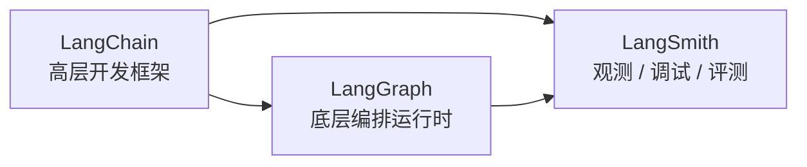

# 一、先搞清楚这三个东西分别是干嘛的 🧭

很多新手一上来就把这三个名字混在一起，这是第一坑。

先记最朴素的理解：

- **LangChain**：帮你更方便地调用模型、组织 Prompt、接工具、做结构化输出、做 Agent。
- **LangSmith**：帮你看日志、看链路、做评测、改 Prompt、分析线上效果。
- **LangGraph**：帮你把 Agent 流程拆成“状态 + 节点 + 边”，做更复杂、更可控、更能持久化的编排。

可以先这样理解它们的关系：

更直白一点：

- 你只是想快速写个能调模型、能调工具的小应用，先学 **LangChain**。
- 你程序已经能跑，但你根本不知道中间哪一步出错了，学 **LangSmith**。
- 你想做“多步决策、可中断、可恢复、可记忆、可人工介入”的 Agent，学 **LangGraph**。

官方对 LangGraph 的定位其实很明确：**它是偏底层的 agent orchestration framework**，重点在 **durable execution、streaming、human-in-the-loop** 这些能力上，而不是“帮你少写代码的语法糖”。这个判断很重要，因为它决定了你不该一上来就啃 LangGraph。

------

