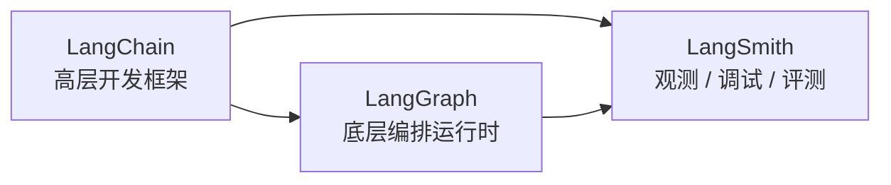

# LangChain、LangSmith、LangGraph 一周入门攻略 😎😎😎

> 适合人群：有一点 Python 基础，想在 7 天内把 LangChain / LangSmith / LangGraph 跑通的人
> 
> 文档基线：基于我阅读的官方文档整理，时间点为 `2026-07-09`

------

## 📑 目录

- [零、先看这 3 篇拆分子笔记](#零先看这-3-篇拆分子笔记)
- [一、先搞清楚这三个东西分别是干嘛的](#一先搞清楚这三个东西分别是干嘛的)
- [二、学习前的几个关键判断](#二学习前的几个关键判断)
- [三、学习环境怎么准备](#三学习环境怎么准备)
- [四、一周学习路线总览](#四一周学习路线总览)
- [五、Day 1：先把 LangChain 跑起来](#五day-1先把-langchain-跑起来)
- [六、Day 2：把 LangChain 的核心能力串起来](#六day-2把-langchain-的核心能力串起来)
- [七、Day 3：接入 LangSmith，看见程序内部发生了什么](#七day-3接入-langsmith看见程序内部发生了什么)
- [八、Day 4：用 LangSmith 做评测，而不是只靠肉眼看输出](#八day-4用-langsmith-做评测而不是只靠肉眼看输出)
- [九、Day 5：开始学 LangGraph，真正理解 Agent 编排](#九day-5开始学-langgraph真正理解-agent-编排)
- [十、Day 6：把 LangGraph 的状态、记忆、持久化吃透](#十day-6把-langgraph-的状态记忆持久化吃透)
- [十一、Day 7：做一个完整小项目，把三者串起来](#十一day-7做一个完整小项目把三者串起来)
- [十二、学习时最容易踩的坑](#十二学习时最容易踩的坑)
- [十三、学完一周后，你至少应该掌握到什么程度](#十三学完一周后你至少应该掌握到什么程度)
- [十四、官方文档阅读顺序](#十四官方文档阅读顺序)

------

## 零、先看这 3 篇拆分子笔记

如果你不想一次看完这篇总攻略，可以先按主题拆开读：

- [[项目与成长/实习方法论/AI应用/LangChain 从入门到能写 Agent]] —— 专门讲 LangChain 起步、Tool、结构化输出、Memory 基本概念
- [[项目与成长/实习方法论/AI应用/LangSmith 调试、观测与评测入门]] —— 专门讲 Trace、调试、Dataset、Evaluation、Prompt 迭代
- [[项目与成长/实习方法论/AI应用/LangGraph 入门：从状态图到可持久化 Agent]] —— 专门讲 State / Node / Edge、Persistence、Checkpointer、Store

如果你现在的状态是：

- 还没跑过 demo：先看 LangChain
- 已经会跑 demo，但不会调试：先看 LangSmith
- 已经会写简单 agent，想继续进阶：先看 LangGraph

------

## 一、先搞清楚这三个东西分别是干嘛的

很多新手一上来就把这三个名字混在一起，这是第一坑。

先记最朴素的理解：

- **LangChain**：帮你更方便地调用模型、组织 Prompt、接工具、做结构化输出、做 Agent。
- **LangSmith**：帮你看日志、看链路、做评测、改 Prompt、分析线上效果。
- **LangGraph**：帮你把 Agent 流程拆成“状态 + 节点 + 边”，做更复杂、更可控、更能持久化的编排。

可以先这样理解它们的关系：



更直白一点：

- 你只是想快速写个能调模型、能调工具的小应用，先学 **LangChain**。
- 你程序已经能跑，但你根本不知道中间哪一步出错了，学 **LangSmith**。
- 你想做“多步决策、可中断、可恢复、可记忆、可人工介入”的 Agent，学 **LangGraph**。

官方对 LangGraph 的定位其实很明确：**它是偏底层的 agent orchestration framework**，重点在 **durable execution、streaming、human-in-the-loop** 这些能力上，而不是“帮你少写代码的语法糖”。这个判断很重要，因为它决定了你不该一上来就啃 LangGraph。

------

## 二、学习前的几个关键判断

### 1. 不要优先看老教程

现在网上很多文章还是：

- `LLMChain`
- 老版 `AgentExecutor`
- 一堆 `OutputParser`
- 很旧的 `python.langchain.com` 路线

但官方在 LangChain v1 已经把方向收得很明显了：

- `langchain` 包命名空间被精简，主打核心 agent building blocks
- 很多旧能力迁到 `langchain-classic`
- 推荐从新版 `docs.langchain.com/oss/python/...` 看

所以你这周学习，**默认按 v1 思路学，不要把大量精力浪费在旧 API 上**。

### 2. 不要一开始追“全家桶”

你只有一周，不可能把生态里所有东西都学全。

这一周真正应该拿下的是：

1. LangChain 怎么快速搭一个可运行的 agent
2. LangSmith 怎么看到 trace、debug、做评测
3. LangGraph 为什么要用 state / node / edge
4. 这三者怎么串成一个完整开发流程

不必把所有 provider、所有 deployment、所有 memory backend 一次学完。

### 3. 用一个模型供应商学到底

官方示例里：

- LangChain quickstart 很常见的是 OpenAI 风格
- LangGraph quickstart 里常拿 Anthropic 做例子
- LangSmith 的评测和 Prompt 工程也经常拿 OpenAI 做例子

你不用跟着它来回切。

这周建议：

- **只选一个你最容易拿到 key 的模型供应商**
- 如果你没有特别偏好，优先用 OpenAI 风格接口来学

核心是理解框架，不是折腾 provider。

------

## 三、学习环境怎么准备

### 1. Python 版本

按官方文档：

- `langchain` 安装要求 **Python 3.10+**
- `langgraph-cli[inmem]` 要求 **Python 3.11+**

所以最省心的做法是：

```bash
python --version
```

如果你现在不是 `3.11+`，建议直接升到 `Python 3.11` 或 `3.12`。

### 2. 建议的虚拟环境

更推荐直接用 **Miniconda**，因为：

- 新手管理 Python 版本更省心
- 包隔离更直观
- 后面切换不同实验环境更方便

```bash
conda create -n langchain-week python=3.11 -y
conda activate langchain-week
```

Windows:

```powershell
conda activate langchain-week
```

macOS / Linux:

```bash
conda activate langchain-week
```

### 3. 这一周最小依赖

```bash
conda install pip -y
pip install -U langchain langchain-openai langgraph langsmith
```

如果你第 5 天要跑本地 LangGraph server，再装：

```bash
pip install -U "langgraph-cli[inmem]"
```

### 4. 环境变量

至少准备：

```powershell
$env:OPENAI_API_KEY="你的key"
$env:LANGSMITH_API_KEY="你的key"
$env:LANGSMITH_TRACING="true"
```

如果你用 Anthropic、Gemini、DeepSeek 或别的 provider，就把对应 provider 的 key 换进去。

------

## 四、一周学习路线总览

| 天数 | 目标 | 产出 |
|---|---|---|
| Day 1 | 跑通 LangChain 基础调用 | 一个最小可运行聊天脚本 |
| Day 2 | 掌握工具调用、结构化输出、记忆概念 | 一个能调工具并返回结构化结果的小 agent |
| Day 3 | 接入 LangSmith tracing | 能在 LangSmith UI 里看完整 trace |
| Day 4 | 学会 dataset / evaluator / experiment | 一套最小评测流程 |
| Day 5 | 理解 LangGraph 的 State / Node / Edge | 一个最小图工作流 |
| Day 6 | 学会 persistence / checkpointer / store | 一个可恢复、有短期记忆的 graph |
| Day 7 | 做完整小项目 | 一个“能回答、能追踪、能评测、能编排”的 demo |

------

## 五、Day 1：先把 LangChain 跑起来

### 今日目标

今天不要想太多，就干一件事：

**先成功调用一次模型，再成功跑一个最小 agent。**

### 你今天只看这些概念

- model
- messages
- tools
- `create_agent`
- `invoke`

### 推荐学习顺序

1. 看官方 `Install`
2. 看官方 `Quickstart`
3. 自己敲一个最小脚本

### 你应该写出的第一个脚本

建议先写一个最小聊天调用：

```python
from langchain_openai import ChatOpenAI

llm = ChatOpenAI(model="gpt-4.1-mini")

result = llm.invoke("用三句话解释什么是 LangChain")
print(result.content)
```

如果这个都没跑通，不要往下学。

### 第二个脚本：最小 Agent

```python
from langchain.agents import create_agent

def get_weather(city: str) -> str:
    """查询天气"""
    return f"{city}，天气晴，25度。"

agent = create_agent(
    model="openai:gpt-4.1-mini",
    tools=[get_weather],
)

result = agent.invoke(
    {"messages": [{"role": "user", "content": "帮我查一下北京天气"}]}
)

print(result)
```

### 今天必须搞懂的点

#### 1. LangChain 现在主线是“围绕 agent 的核心构件”

不是以前那种“到处都是 chain 类”。

#### 2. `create_agent` 很重要

它是你后面学习 LangChain 的主入口之一。

#### 3. Tool 本质上就是“让模型调用你的 Python 函数”

不要把它神化。

### 今天的验收标准

- 你能解释 `ChatOpenAI().invoke(...)` 和 `create_agent(...).invoke(...)` 的区别
- 你能让模型成功调用一个工具
- 你知道报错优先看哪里：API key、模型名、包没装、环境没激活

------

## 六、Day 2：把 LangChain 的核心能力串起来

### 今日目标

今天开始从“能跑”升级到“能做点正经事”。

重点只抓三件事：

1. 结构化输出
2. memory 基本概念
3. RAG 先有感知，不深挖

### 1. 先学结构化输出

这是最值得优先掌握的 LangChain 能力之一。

原因很简单：

- 真实项目里，后端更需要结构化结果，不需要一大段废话
- 结构化输出是你从“玩具 demo”走向“工程化”的第一步

推荐先练：

```python
from pydantic import BaseModel, Field
from langchain_openai import ChatOpenAI

class UserIntent(BaseModel):
    intent: str = Field(description="用户意图")
    urgency: str = Field(description="紧急程度")
    summary: str = Field(description="一句话总结")

llm = ChatOpenAI(model="gpt-4.1-mini")
structured_llm = llm.with_structured_output(UserIntent)

result = structured_llm.invoke("我明天要面试，想快速复习 Redis 持久化")
print(result)
```

你今天不用纠结所有细节，但要知道：

- 现在官方主线更强调 **schema + structured output**
- 别一上来就迷恋老式 parser

### 2. 理解 short-term memory 和 long-term memory

LangChain 文档里已经把这两件事讲得很明确了：

- **short-term memory**：线程级、对话内、会随着当前会话推进而更新
- **long-term memory**：跨线程、跨会话，长期保存用户偏好、事实、知识

你今天先建立概念，不需要一次做完所有实现。

### 3. RAG 先知道它是什么

这周你不需要把检索系统学成向量数据库专家。

你只需要知道：

- LangChain 可以把“检索到的上下文”喂给模型
- RAG 不是框架本身，RAG 是一种应用模式

如果还有时间，再看官方 `Build a RAG agent with LangChain`。

### 今天的验收标准

- 你能写出一个结构化输出 demo
- 你能说清短期记忆和长期记忆的区别
- 你知道 LangChain 不等于 RAG，RAG 只是 LangChain 常见用法之一

------

## 七、Day 3：接入 LangSmith，看见程序内部发生了什么

### 今日目标

今天开始学会一句非常重要的话：

**LLM 应用不能只看最终答案，要看中间链路。**

LangSmith 的第一价值不是“高级监控平台”，而是：

**让你终于能看见 agent 每一步干了什么。**

### 先理解 LangSmith 里最关键的几个词

官方对数据结构的定义可以直接记成下面这样：

- **Project**：一个应用或服务的 trace 容器
- **Trace**：一次完整操作的执行链路
- **Run**：链路里某一个具体步骤
- **Thread**：多轮对话下，多条 trace 组成的一条会话线

这是你后面读 UI、读日志、读评测结果的基础词汇表。

### 今天怎么做

#### 1. 开 tracing

```powershell
$env:LANGSMITH_API_KEY="你的key"
$env:LANGSMITH_TRACING="true"
```

#### 2. 跑昨天的 LangChain 脚本

如果你用的是 LangChain，官方说明它支持自动 tracing，不需要你手搓很多埋点。

#### 3. 打开 LangSmith UI 看 trace

重点不是“页面按钮怎么点”，而是你要学会看：

- 输入是什么
- 中间有没有调用 tool
- tool 入参对不对
- 最终输出是不是偏题
- token 消耗和耗时大概怎样

### 今天必须观察的三个问题

1. 模型到底有没有按你的预期调用工具
2. Prompt 是不是把模型带偏了
3. 明明结果错了，到底错在模型、工具还是你自己的代码

### 如果你不是 LangChain 应用怎么办

LangSmith 也支持手动埋点。官方给了三种常见方式：

- `@traceable`
- `trace` 上下文
- `RunTree` API

但你这周先别深入，先把自动 tracing 用熟。

### 今天的验收标准

- 你能在 LangSmith 里找到自己程序的一条 trace
- 你能点开其中一个 run 看输入输出
- 你能说清一个 bug 大概卡在哪一层

------

## 八、Day 4：用 LangSmith 做评测，而不是只靠肉眼看输出

### 今日目标

今天开始把“我感觉这个回答还行”升级成“我有一套最小评测流程”。

官方在评测 quickstart 里给的骨架非常清楚：

1. **Dataset**
2. **Target function**
3. **Evaluators**

这个三件套你一定要背下来。

### 为什么评测重要

因为 LLM 应用有两个天然问题：

- 输出不稳定
- 小改 Prompt / 模型 / 工具，就可能整体变味

所以评测不是锦上添花，而是你后面敢不敢改代码的底气。

### 今天建议做的最小实验

做一个“意图分类”小任务。

#### 1. 准备 10 到 20 条数据集

例如：

- “帮我总结这段 Java 并发笔记”
- “请把这个接口文档改成更正式一点”
- “解释一下 Redis 为什么会出现缓存击穿”

然后给每条数据一个参考标签：

- `总结`
- `改写`
- `解释`

#### 2. 写一个 target function

就是你前一天的结构化输出函数。

#### 3. 写一个 evaluator

最简单直接：

- 看 `intent` 是否等于参考答案

### 你今天要顺便理解 dataset 的版本化

官方文档里提到，LangSmith 的 dataset 是有版本概念的。

这件事在真实项目里非常重要，因为：

- 你后面会不断补坏例子
- 你需要知道“这次实验到底是基于哪一版测试集”

### 今天的验收标准

- 你能说出评测三件套是什么
- 你能跑一次最小 evaluation
- 你知道为什么“只靠自己读几条输出”不叫评测

------

## 九、Day 5：开始学 LangGraph，真正理解 Agent 编排

### 今日目标

今天才开始碰 LangGraph，顺序不要倒。

因为官方自己就说得很直：

- LangGraph 是 **low-level**
- 它关注的是 **agent orchestration**
- 如果你刚开始接触 agent，应该先熟悉 models 和 tools，甚至先从 LangChain agents 入手

这正是我们把它放到第 5 天的原因。

### 今天只学三个词

- **State**
- **Node**
- **Edge**

官方 Graph API 概述里给得很清楚：

1. `State`：当前应用快照
2. `Node`：干活的函数
3. `Edge`：决定下一步走向的函数

一句话记忆：

**node 干活，edge 决定往哪走，state 负责把过程中的信息串起来。**

### 今天推荐的第一个图

不要一上来就多 Agent。

先做最小图：

1. 读取用户问题
2. 判断是否需要工具
3. 调工具或直接回答
4. 输出结果

### 你今天要理解的本质

LangGraph 不是只是把代码画成流程图。

它的价值在于：

- 可以循环
- 可以中断再恢复
- 可以把状态持久化
- 可以做 human-in-the-loop
- 可以更细粒度控制 agent 的执行

### Graph API 还是 Functional API

官方给出的判断也很实用：

- 想显式地定义图结构，用 **Graph API**
- 想保留普通 Python 控制流、少改已有代码，用 **Functional API**

如果你是新手，我建议：

- **先学 Graph API**
- 学会后再看 Functional API

因为 Graph API 更容易把 agent 编排的本质看清楚。

### 今天的验收标准

- 你能解释 State / Node / Edge 各是什么
- 你能说出 LangGraph 和 LangChain agent 的层次区别
- 你能跑一个最小 graph demo

------

## 十、Day 6：把 LangGraph 的状态、记忆、持久化吃透

### 今日目标

今天学 LangGraph 最重要的工程能力：

- persistence
- checkpointer
- store

这是 LangGraph 和“普通 while 循环 agent”差距最大的地方之一。

### 1. 先分清两类持久化

官方文档把它拆得很清楚：

- **Checkpointer**：保存 thread 级 graph state，适合短期记忆、会话恢复、human-in-the-loop、time travel、fault tolerance
- **Store**：保存 graph state 之外的应用数据，适合长期记忆、用户偏好、共享知识

这里你会发现一个很重要的呼应：

- LangChain 的 long-term memory，底层就建立在 **LangGraph stores** 上

也就是说：

**LangChain 的一些高级能力，底层很多是站在 LangGraph runtime 上的。**

### 2. 今天建议做的 demo

做一个“学习助手”：

- 第一轮：用户说“我正在准备 Java 面试”
- 第二轮：用户说“继续刚才的话题，给我 5 个 Redis 高频题”

你要做到：

- 同一个 thread 下能续接上下文
- 程序中断后还能恢复

### 3. 顺手看一下本地 server

如果你精力够，可以走一遍官方 `Run a local server`：

- 安装 `langgraph-cli[inmem]`
- `langgraph new ...`
- `langgraph dev`
- 用 Studio 连本地服务

这一步能帮你把“写 graph”升级成“把 graph 当成服务运行”。

### 今天的验收标准

- 你能说出 checkpointer 和 store 的区别
- 你能解释为什么 LangGraph 适合长流程 agent
- 你能跑一个最小持久化 demo

------

## 十一、Day 7：做一个完整小项目，把三者串起来

### 项目建议

做一个 **“学习笔记问答助手”**，非常适合你当前场景。

功能不要贪多，控制在下面这个范围就够：

1. 用户输入一个技术问题
2. agent 判断是直接回答，还是先查笔记片段
3. 返回结构化结果：
   - `answer`
   - `source`
   - `confidence`
4. 全链路接入 LangSmith tracing
5. 准备 10 条测试集，用 LangSmith 做一次最小评测
6. 如果你想进阶，再把它改造成 LangGraph 版本

### 推荐项目分层

```text
app/
  main.py
  llm.py
  tools.py
  schemas.py
  evals.py
```

### 第一步：先做 LangChain 版本

目标：

- 能问
- 能调工具
- 能结构化输出

### 第二步：接 LangSmith

目标：

- 能看到每次回答的 trace
- 能看到 tool 调用链路

### 第三步：补评测

目标：

- 至少一组 dataset
- 至少一个 evaluator

### 第四步：改造为 LangGraph 版本

目标：

- 显式 state
- 显式 node / edge
- 能在后面继续加 human-in-the-loop

### 这个项目最重要的不是“做得大”

而是你最后能亲口讲清楚：

1. 为什么先用 LangChain 快速起步
2. 为什么要用 LangSmith 看 trace 和评测
3. 为什么复杂场景要切到 LangGraph

如果你能讲清这三句话，这周就没白学。

------

## 十二、学习时最容易踩的坑

### 1. 一头扎进 LangGraph，结果前面基础没打牢

后果就是：

- 看得懂名词
- 写不出 demo
- 不知道为什么需要 graph

### 2. 把 LangSmith 当成“可有可无”

这是很典型的新手错误。

没有 tracing，你调 agent 时几乎就是盲飞。

### 3. 过早折腾多模型、多 provider

一周入门阶段，**稳定比花哨重要**。

### 4. 迷信 Prompt，忽略结构化输出和评测

真正工程化的核心，不是“写出一段很帅的 Prompt”，而是：

- 有 schema
- 有 trace
- 有 evaluation
- 有可恢复的流程

### 5. 只会看最终输出，不会拆过程

你之后面试或做项目汇报时，别人真正想听的是：

- 工具什么时候调用
- 状态怎么流转
- 哪里可以中断恢复
- 怎么验证改动是否真的更好

------

## 十三、学完一周后，你至少应该掌握到什么程度

如果这一周学对了，最后你至少应该能做到：

### LangChain

- 能独立写一个最小 agent
- 能做工具调用
- 能做结构化输出
- 知道 short-term memory / long-term memory 的基本区别

### LangSmith

- 能打开 tracing
- 能读懂 project / trace / run / thread
- 能做最小 dataset + evaluator + experiment

### LangGraph

- 能解释 State / Node / Edge
- 能区分 Graph API 和 Functional API
- 能说清 checkpointer / store 的角色
- 能写一个最小有状态流程

如果再进一步：

- 你能把一个 LangChain 小 demo 重构成 LangGraph 版本

这就已经超过“只会调一下 LLM API”的水平了。

------

## 十四、官方文档阅读顺序

下面这个顺序是我按“新手最容易吸收”的方式重排的，不是官网默认导航顺序。

### 第一阶段：LangChain 起步

1. LangChain Overview  
   https://docs.langchain.com/oss/python/langchain/overview
2. Install  
   https://docs.langchain.com/oss/python/langchain/install
3. Quickstart  
   https://docs.langchain.com/oss/python/langchain/quickstart
4. Agents  
   https://docs.langchain.com/oss/python/langchain/agents
5. Models  
   https://docs.langchain.com/oss/python/langchain/models

### 第二阶段：LangChain 进阶但只学高价值部分

1. Short-term memory  
   https://docs.langchain.com/oss/python/langchain/short-term-memory
2. Long-term memory  
   https://docs.langchain.com/oss/python/langchain/long-term-memory
3. Build a RAG agent with LangChain  
   https://docs.langchain.com/oss/python/langchain/rag
4. LangChain v1 migration guide  
   https://docs.langchain.com/oss/python/migrate/langchain-v1

### 第三阶段：LangSmith

1. Tracing quickstart  
   https://docs.langchain.com/langsmith/observability-quickstart
2. Observability concepts  
   https://docs.langchain.com/langsmith/observability-concepts
3. Trace an LLM application tutorial  
   https://docs.langchain.com/langsmith/observability-llm-tutorial
4. Evaluation quickstart  
   https://docs.langchain.com/langsmith/evaluation-quickstart
5. Manage datasets  
   https://docs.langchain.com/langsmith/manage-datasets
6. Prompt engineering quickstart  
   https://docs.langchain.com/langsmith/prompt-engineering-quickstart

### 第四阶段：LangGraph

1. LangGraph Overview  
   https://docs.langchain.com/oss/python/langgraph/overview
2. Quickstart  
   https://docs.langchain.com/oss/python/langgraph/quickstart
3. Graph API overview  
   https://docs.langchain.com/oss/python/langgraph/graph-api
4. Thinking in LangGraph  
   https://docs.langchain.com/oss/python/langgraph/thinking-in-langgraph
5. Persistence  
   https://docs.langchain.com/oss/python/langgraph/persistence
6. Functional API overview  
   https://docs.langchain.com/oss/python/langgraph/functional-api
7. Workflows and agents  
   https://docs.langchain.com/oss/python/langgraph/workflows-agents
8. Run a local server  
   https://docs.langchain.com/oss/python/langgraph/local-server

------

## 最后一段建议

如果你只有一周，最优策略不是“把所有页面都读完”，而是：

1. 每天只啃一个主目标
2. 每天都必须有代码产出
3. 每天都要能回答“今天我到底学会了什么”
4. 第 7 天一定要做一个完整小 demo

因为这套东西最怕的不是英文，而是：

**你看懂了页面，但没有把它们串成自己的工程思维。**

而这份学习路线，本质上就是帮你把官网从“按产品文档组织”，重排成“按新手吸收顺序组织”。

------

## 🔗 相关补充

- 如果你后面想把这套内容往 Java 后端项目里落，可以先把 Python 版 demo 跑通，再考虑 Java 服务怎么接大模型能力。
- 如果你学到 LangGraph 觉得抽象，不是你菜，而是它本来就比 LangChain 更底层。先稳住 LangChain + LangSmith，再回来看 LangGraph 会顺很多。
