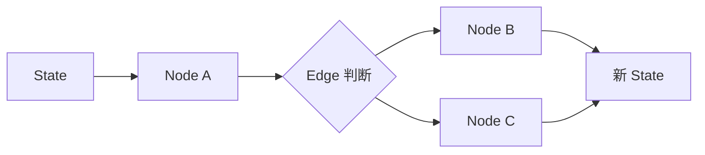

# 二、LangGraph 到底解决什么问题 🏗️

如果只用最朴素的方式写 agent，很多人会写成这样：

- while 循环
- 判断要不要调工具
- 调完工具再继续
- 手动拼状态

这种方式在 demo 阶段可能没问题，但一旦流程变复杂，就会出现这些问题：

- 状态管理混乱
- 很难中断恢复
- 很难做人工介入
- 很难持久化
- 很难把流程拆清楚

LangGraph 的价值，就是把这些事变成一个更清晰的运行时模型。

你可以把它理解成：

------

