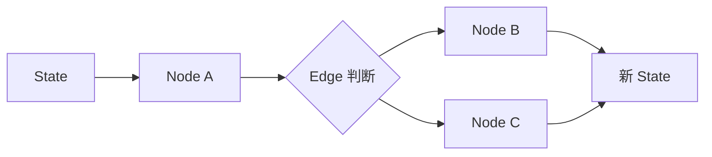

# LangGraph 入门：从状态图到可持久化 Agent 😎😎😎

> 适合人群：已经知道 LangChain 的基本玩法，想继续理解更底层 Agent 编排的人
> 
> 文档基线：基于官方文档整理，时间点为 `2026-07-09`

------

## 📑 目录

- [一、先说结论：为什么 LangGraph 不适合一上来就学](#一先说结论为什么-langgraph-不适合一上来就学)
- [二、LangGraph 到底解决什么问题](#二langgraph-到底解决什么问题)
- [三、最核心的三个概念：State、Node、Edge](#三最核心的三个概念statenodeedge)
- [四、Graph API 和 Functional API 怎么选](#四graph-api-和-functional-api-怎么选)
- [五、为什么 LangGraph 比普通 Agent 循环更强](#五为什么-langgraph-比普通-agent-循环更强)
- [六、第一个 LangGraph 该长什么样](#六第一个-langgraph-该长什么样)
- [七、Thinking in LangGraph：真正要学的是拆流程的方式](#七thinking-in-langgraph真正要学的是拆流程的方式)
- [八、Persistence：LangGraph 最有工程价值的一层能力](#八persistencelanggraph-最有工程价值的一层能力)
- [九、Checkpointer 和 Store 到底有什么区别](#九checkpointer-和-store-到底有什么区别)
- [十、本地运行 LangGraph Server 的意义](#十本地运行-langgraph-server-的意义)
- [十一、哪些场景更适合上 LangGraph](#十一哪些场景更适合上-langgraph)
- [十二、LangGraph 的关键技术细节](#十二langgraph-的关键技术细节)
- [十三、LangGraph 的最佳实践](#十三langgraph-的最佳实践)
- [十四、练手项目 1：写一个最小状态图](#十四练手项目-1写一个最小状态图)
- [十五、练手项目 2：加上条件分支和工具调用](#十五练手项目-2加上条件分支和工具调用)
- [十六、练手项目 3：体验持久化思路](#十六练手项目-3体验持久化思路)
- [十七、最容易踩的坑](#十七最容易踩的坑)
- [十八、学完这篇你应该掌握什么](#十八学完这篇你应该掌握什么)

------

## 一、先说结论：为什么 LangGraph 不适合一上来就学

这个结论不是我主观拍脑袋说的，官方定位本身就已经很明确：

- LangGraph 是 **low-level orchestration framework**
- 它关注的是 **long-running、stateful agents**
- 如果你刚开始接触 agents，应该先熟悉 models 和 tools
- 如果你只是想快速起步，优先用 LangChain 的高层 agent

所以：

**LangGraph 不适合零基础直接入门，但非常适合在你已经会写最小 Agent 之后继续进阶。**

这也是为什么很多人第一次看 LangGraph 会觉得抽象。

不是你不行，而是它本来就更底层。

------

## 二、LangGraph 到底解决什么问题

如果只用最朴素的方式写 agent，很多人会写成这样：

- while 循环
- 判断要不要调工具
- 调完工具再继续
- 手动拼状态

这种方式在 demo 阶段可能没问题，但一旦流程变复杂，就会出现这些问题：

- 状态管理混乱
- 很难中断恢复
- 很难做人工介入
- 很难持久化
- 很难把流程拆清楚

LangGraph 的价值，就是把这些事变成一个更清晰的运行时模型。

你可以把它理解成：



------

## 三、最核心的三个概念：State、Node、Edge

这一部分是 LangGraph 的入门大门。

### 1. State

State 是当前应用的共享快照。

你可以把它理解成：

- 当前对话历史
- 当前已经得到的中间结果
- 当前流程运行到哪
- 当前用户上下文是什么

State 是整个 graph 的信息中心。

### 2. Node

Node 就是干活的函数。

它可以做这些事：

- 调 LLM
- 调工具
- 做普通 Python 逻辑
- 更新状态

最重要的一点是：

**Node 不一定非得是模型调用，它就是一个普通但有职责的执行单元。**

### 3. Edge

Edge 决定下一步往哪走。

它可以是：

- 固定跳转
- 条件分支
- 循环回路

一句话记忆：

- **Node 干活**
- **Edge 决定往哪走**
- **State 负责把上下文串起来**

------

## 四、Graph API 和 Functional API 怎么选

官方给了两套主要思路。

### 1. Graph API

适合：

- 你想显式地定义 graph
- 你想把节点和边看得很清楚
- 你更愿意用声明式方式组织流程

优点：

- 结构直观
- 适合理解编排本质
- 复杂流程更清晰

### 2. Functional API

适合：

- 你想保留普通 Python 控制流
- 你不想把已有代码重构成很显式的图
- 你想以更少改动接入 persistence / streaming / interrupts

官方对 Functional API 的描述很明确：

- 它允许你继续使用 `if`、`for`、函数调用等普通语言结构
- 通过 `@entrypoint` 和 `@task` 接入关键能力

### 3. 新手怎么选

如果你是第一次学 LangGraph，我建议：

- **先学 Graph API**

原因很简单：

- 它更能帮你形成 LangGraph 的心智模型

等你把本质吃透了，再看 Functional API 会轻松很多。

------

## 五、为什么 LangGraph 比普通 Agent 循环更强

它强的地方，不是“更炫”，而是更工程化。

官方在多个页面反复强调的能力，核心有这些：

- durable execution
- streaming
- human-in-the-loop
- persistence
- stateful workflows

翻译成工程语言就是：

### 1. 可持续执行

流程长、步骤多时，不容易因为一次中断就全丢。

### 2. 可流式输出

更适合做交互式 Agent。

### 3. 可人工介入

某些关键节点可以暂停，等人确认，再继续。

### 4. 可持久化

状态不是只存在内存里。

### 5. 可表达复杂流程

有分支、有循环、有子图，都更自然。

------

## 六、第一个 LangGraph 该长什么样

新手最容易犯的错之一，就是一上来就想做多 Agent。

别这样。

你第一个 LangGraph 应该尽量简单。

建议做这种结构：

1. 接收用户问题
2. 判断是否需要工具
3. 需要则调工具，不需要则直接回答
4. 汇总结果输出

这个流程已经足够帮你理解：

- state 怎么流转
- node 怎么拆
- edge 怎么判断

如果你连这个最小图都没写过，直接上复杂 agent，只会把自己绕晕。

### 一个最小可运行骨架

下面这个例子不追求花哨，只是帮你先体会 graph 的基本组成。

```python
from typing import TypedDict
from langgraph.graph import StateGraph, START, END

class MyState(TypedDict):
    question: str
    answer: str

def answer_node(state: MyState) -> MyState:
    question = state["question"]
    return {
        **state,
        "answer": f"你问的是：{question}。这是一个最小 LangGraph 返回。",
    }

graph_builder = StateGraph(MyState)
graph_builder.add_node("answer_node", answer_node)
graph_builder.add_edge(START, "answer_node")
graph_builder.add_edge("answer_node", END)

graph = graph_builder.compile()

result = graph.invoke({"question": "什么是 LangGraph？", "answer": ""})
print(result)
```

这个最小例子的目的只有一个：

- 让你真正看到 `State + Node + Edge` 怎么拼起来

------

## 七、Thinking in LangGraph：真正要学的是拆流程的方式

官方有一篇很重要的文档叫：

- `Thinking in LangGraph`

这篇文档真正重要的不是示例代码本身，而是它在教你一种思维方式：

### 1. 先把问题拆成离散步骤

也就是：

- 哪些步骤是独立节点

### 2. 再定义步骤之间怎么转移

也就是：

- 哪些是固定顺序
- 哪些是条件分支

### 3. 再决定哪些信息放进共享 state

不是所有东西都该乱塞。

你应该想的是：

- 哪些状态后续节点还会用到
- 哪些只是临时变量

这其实已经不是“学框架 API”了，而是在学一种 agent 工作流设计方法。

------

## 八、Persistence：LangGraph 最有工程价值的一层能力

如果说 LangGraph 哪块最值得工程师重点理解，我会优先说 persistence。

因为这块直接决定：

- 你的 Agent 能不能恢复
- 能不能跨步骤记住上下文
- 能不能支持人工中断后继续执行

官方对 persistence 的定义也很清晰：

- 它让应用在单次 graph run 之外仍能保留信息

这对下面这些场景非常重要：

- 多轮会话连续处理
- 长任务中断恢复
- 故障恢复
- 需要记忆的 Agent

### 先用一个“状态会传递”的例子找感觉

```python
from typing import TypedDict
from langgraph.graph import StateGraph, START, END

class StudyState(TypedDict):
    topic: str
    notes: str
    final_answer: str

def collect_notes(state: StudyState) -> StudyState:
    topic = state["topic"]
    return {
        **state,
        "notes": f"{topic} 的重点：先看核心概念，再整理高频题。",
    }

def generate_answer(state: StudyState) -> StudyState:
    return {
        **state,
        "final_answer": f"学习建议：{state['notes']}",
    }

builder = StateGraph(StudyState)
builder.add_node("collect_notes", collect_notes)
builder.add_node("generate_answer", generate_answer)
builder.add_edge(START, "collect_notes")
builder.add_edge("collect_notes", "generate_answer")
builder.add_edge("generate_answer", END)

graph = builder.compile()
result = graph.invoke(
    {"topic": "LangGraph", "notes": "", "final_answer": ""}
)
print(result)
```

这个例子虽然还没真的持久化，但它能帮助你先看到：

- 一个节点产生的状态，后一个节点可以继续用

------

## 九、Checkpointer 和 Store 到底有什么区别

这一块一定要分清，不然后面很容易全混成“记忆”。

### 1. Checkpointer

它保存的是：

- thread 级 graph state

适合：

- 短期记忆
- 当前会话延续
- human-in-the-loop
- time travel
- fault tolerance

更直白一点：

**checkpointer 负责把“当前这条流程跑到哪了”记下来。**

### 2. Store

它保存的是：

- graph state 之外的应用级数据

适合：

- 长期记忆
- 用户偏好
- 共享知识
- 跨线程数据

更直白一点：

**store 负责把“以后还想再用的信息”存下来。**

### 3. 一句话区分

- `checkpointer`：更像“流程存档”
- `store`：更像“长期资料库”

### 练手思路

做两个实验：

1. 把“当前这次对话已经走到哪一步”放进流程状态里
2. 把“用户长期偏好 Java / Redis / 分布式”放进单独数据结构里

这样你会更容易体会：

- 什么是短期流程状态
- 什么是长期业务信息

------

## 十、本地运行 LangGraph Server 的意义

官方提供了本地 server 路线：

- 安装 `langgraph-cli[inmem]`
- `langgraph new ...`
- `langgraph dev`

还可以用 Studio 连过去看。

### 这件事为什么值得学

因为它能帮你把 LangGraph 从：

- “一段本地 Python 代码”

升级成：

- “一个可调试、可交互、可测试的 agent 服务”

### 新手怎么看待这一块

你第一遍不用把它当部署教程。

你只要理解：

- LangGraph 不只是写图
- 它还有把图作为服务运行起来的配套方式

就够了。

------

## 十一、哪些场景更适合上 LangGraph

不是所有 LLM 应用都需要 LangGraph。

下面这些场景更值得考虑：

### 1. 流程有明显多步决策

比如：

- 先分类，再检索，再生成，再复核

### 2. 需要可恢复执行

比如：

- 长任务不能因为一次错误就全部重来

### 3. 需要 human-in-the-loop

比如：

- 关键节点要人工确认

### 4. 需要持久化状态

比如：

- 多轮对话要续接
- 跨步骤要留状态

### 5. 多 Agent 或子图协作

这类场景 LangGraph 会比手搓流程更稳。

反过来，如果你只是：

- 调一次模型
- 调一个工具
- 回一个结果

那先用 LangChain 就够了。

------

## 十二、LangGraph 的关键技术细节

### 1. State 是共享数据协议，不只是一个字典

虽然你可以把它写成 `TypedDict`，但更重要的是：

- 它定义了节点之间如何交换信息

也就是说，state 本质上是：

- 图里各节点共同遵守的数据契约

### 2. Node 的职责应该稳定、可预测

一个 node 最好做一类事：

- 路由
- 检索
- 生成
- 校验

如果 node 既路由又检索又生成，图结构很快就会失去意义。

### 3. Edge 决定的是控制流

Graph 和普通链式调用最大的不同之一，就是：

- 控制流变成了显式设计对象

这会迫使你思考：

- 为什么这里要分支
- 为什么这里要循环
- 为什么这里能直接结束

### 4. Persistence 不是可选装饰，而是 LangGraph 的核心价值之一

如果你不用持久化，很多场景其实直接用 LangChain 就够了。

LangGraph 真正的工程优势，经常来自：

- 中断恢复
- thread state
- human-in-the-loop
- 跨步骤持续执行

### 5. Checkpointer 和 Store 分层很关键

这是框架设计里非常重要的一层边界：

- checkpointer：流程态
- store：业务态

如果混用，后面几乎必乱。

### 6. LangGraph 很适合表达“先判断，再执行，再判断”的流程

因为现实里的 agent 往往不是一条直线：

- 可能先分类
- 再决定要不要查资料
- 查完再生成
- 生成后再校验
- 校验失败再回退

这类流程用 graph 比用长函数更清晰。

------

## 十三、LangGraph 的最佳实践

### 1. 先画流程，再写 graph

哪怕只是纸上列步骤，也比直接写代码强。

你至少要先回答：

- 有哪些节点
- 节点之间怎么转移
- 哪些数据必须放进 state

### 2. state 只放跨节点需要共享的数据

不要什么都塞。

推荐放：

- 当前问题
- 检索结果
- 最终答案
- 路由决定

不推荐放：

- 只在一个节点里临时用一下的局部变量

### 3. 路由节点和执行节点分开

推荐：

- `router`
- `search`
- `generate`
- `validate`

而不是一个大节点里写满 `if/else`。

### 4. 给 graph 预留“失败分支”

真实项目里，不要只设计 happy path。

你要提前想：

- 工具失败怎么办
- 检索为空怎么办
- 校验没过怎么办

### 5. 先做最小闭环，再加持久化和人工介入

顺序建议：

1. 先让图跑通
2. 再加 conditional edges
3. 再加 persistence
4. 再加 human-in-the-loop

### 6. 节点要可测试

一个 node 如果离开整个 graph 就完全测不了，通常说明它太复杂了。

更好的方式是：

- 节点本身尽量像普通函数
- graph 只负责组织它们

### 7. 不要把 LangGraph 当作“所有项目默认入口”

如果场景不复杂，就别硬上。

这本身也是一种最佳实践。

------

## 十四、练手项目 1：写一个最小状态图

### 目标

写一个只有 2 个节点的图：

1. 接收问题
2. 生成简短回答

### 参考代码

```python
from typing import TypedDict
from langgraph.graph import StateGraph, START, END

class QAState(TypedDict):
    question: str
    answer: str

def prepare_question(state: QAState) -> QAState:
    return {
        **state,
        "question": state["question"].strip(),
    }

def answer_question(state: QAState) -> QAState:
    return {
        **state,
        "answer": f"这是针对问题“{state['question']}”的最小回答。",
    }

builder = StateGraph(QAState)
builder.add_node("prepare_question", prepare_question)
builder.add_node("answer_question", answer_question)
builder.add_edge(START, "prepare_question")
builder.add_edge("prepare_question", "answer_question")
builder.add_edge("answer_question", END)

graph = builder.compile()
print(graph.invoke({"question": " 什么是状态图？ ", "answer": ""}))
```

### 练手要求

- 把 `answer_question` 改成调用真实 LLM
- 增加一个 `summary` 字段
- 看看最终 state 会不会包含所有中间结果

------

## 十五、练手项目 2：加上条件分支和工具调用

这是 LangGraph 真正开始有意思的地方。

### 目标

让 graph 先判断：

- 如果用户问题里包含 `Redis` 或 `MySQL`，就去查笔记工具
- 否则直接回答

### 参考代码

```python
from typing import TypedDict
from langgraph.graph import StateGraph, START, END

class AgentState(TypedDict):
    question: str
    route: str
    notes: str
    answer: str

def router(state: AgentState) -> AgentState:
    question = state["question"].lower()
    if "redis" in question or "mysql" in question:
        return {**state, "route": "search"}
    return {**state, "route": "direct"}

def search_notes(state: AgentState) -> AgentState:
    q = state["question"].lower()
    if "redis" in q:
        notes = "Redis：先看数据类型、持久化、缓存问题。"
    elif "mysql" in q:
        notes = "MySQL：先看索引、事务、锁、MVCC。"
    else:
        notes = "暂无匹配笔记。"
    return {**state, "notes": notes}

def direct_answer(state: AgentState) -> AgentState:
    return {**state, "answer": f"直接回答：{state['question']}"}

def answer_with_notes(state: AgentState) -> AgentState:
    return {
        **state,
        "answer": f"结合笔记给出回答：{state['notes']}",
    }

def route_next(state: AgentState) -> str:
    return state["route"]

builder = StateGraph(AgentState)
builder.add_node("router", router)
builder.add_node("search_notes", search_notes)
builder.add_node("direct_answer", direct_answer)
builder.add_node("answer_with_notes", answer_with_notes)

builder.add_edge(START, "router")
builder.add_conditional_edges(
    "router",
    route_next,
    {
        "search": "search_notes",
        "direct": "direct_answer",
    },
)
builder.add_edge("search_notes", "answer_with_notes")
builder.add_edge("direct_answer", END)
builder.add_edge("answer_with_notes", END)

graph = builder.compile()

print(graph.invoke({"question": "帮我复习 Redis", "route": "", "notes": "", "answer": ""}))
print(graph.invoke({"question": "什么是 LangGraph", "route": "", "notes": "", "answer": ""}))
```

### 这里你要重点体会

- `router` 节点并不直接回答问题，它只是决定流程往哪走
- `conditional_edges` 是图编排的关键能力

------

## 十六、练手项目 3：体验持久化思路

这里先不强求你一次搞懂所有后端存储细节，但至少要先用“线程状态”的思路练手。

### 目标

模拟两轮对话：

1. 第一轮记录用户想学什么
2. 第二轮基于上一轮主题继续回答

### 参考代码

```python
thread_state = {
    "topic": None,
    "history": [],
}

def first_turn(user_input: str):
    thread_state["topic"] = user_input
    thread_state["history"].append(user_input)
    return f"已记录当前学习主题：{user_input}"

def second_turn(user_input: str):
    thread_state["history"].append(user_input)
    topic = thread_state["topic"]
    return f"继续围绕 {topic} 回答。你刚才又问了：{user_input}"

print(first_turn("Redis"))
print(second_turn("继续给我 5 个高频问题"))
print(thread_state)
```

这个例子还不是 LangGraph 官方 persistence API 的完整写法，但它很适合作为过渡理解：

- 为什么要有 thread
- 为什么要存状态
- 为什么中断后恢复需要“之前已经保存的上下文”

------

## 十七、最容易踩的坑

### 1. 没学会 LangChain 就硬上 LangGraph

这样通常只会让你同时困在“模型调用”和“编排模型”两层复杂度里。

### 2. 把 Node 全写成大一坨

这样 graph 看似存在，实际上失去了拆流程的意义。

### 3. State 乱塞数据

共享状态不是垃圾桶。

### 4. 分不清 checkpointer 和 store

最后会把短期流程状态和长期业务数据混在一起。

### 5. 用 LangGraph 解决本来不复杂的问题

这会增加理解和维护成本。

### 6. 没设计失败路径

真实流程里，这个问题迟早会暴露。

### 7. 把所有共享数据都塞进 state

这会让 state 迅速膨胀，越来越难维护。

------

## 十八、学完这篇你应该掌握什么

如果你把这篇内容吃透了，至少应该能做到：

- 能说清 LangGraph 为什么比 LangChain 更底层
- 能解释 State / Node / Edge
- 能区分 Graph API 和 Functional API
- 能理解 persistence 的价值
- 能区分 checkpointer 和 store
- 能判断一个场景到底该不该上 LangGraph

做到这里，你就已经开始具备“设计 Agent 工作流”的视角了。

------

## 🔗 推荐继续看

- [[项目与成长/实习方法论/AI应用/LangChain 从入门到能写 Agent]] —— 先把高层应用能力跑通
- [[项目与成长/实习方法论/AI应用/LangSmith 调试、观测与评测入门]] —— 补上观测和评测能力
- [[项目与成长/实习方法论/AI应用/LangChain、LangSmith、LangGraph 一周入门攻略]] —— 回到总路线做一周规划
