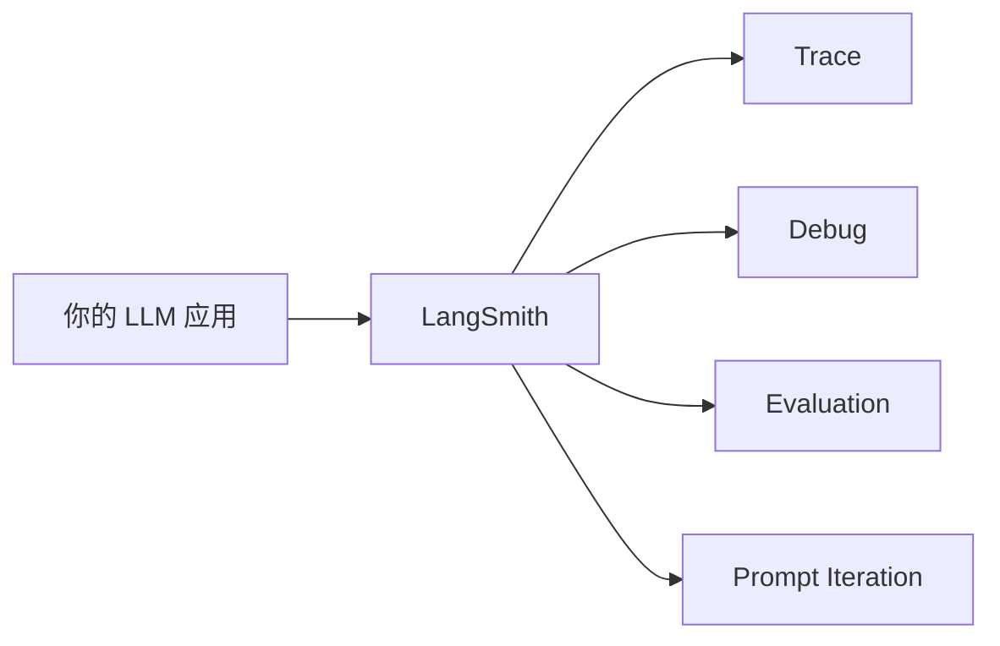

# LangSmith 调试、观测与评测入门 😎😎😎

> 适合人群：已经能跑一个最小 LLM / LangChain 应用，但调试还靠猜的人
> 
> 文档基线：基于官方文档整理，时间点为 `2026-07-09`

------

## 📑 目录

- [一、先说结论：为什么 LangSmith 很值得学](#一先说结论为什么-langsmith-很值得学)
- [二、LangSmith 到底是干嘛的](#二langsmith-到底是干嘛的)
- [三、最关键的四个词：Project、Trace、Run、Thread](#三最关键的四个词projecttracerunthread)
- [四、第一步：先把 Tracing 打开](#四第一步先把-tracing-打开)
- [五、看 Trace 时到底应该看什么](#五看-trace-时到底应该看什么)
- [六、如果不用 LangChain，还能怎么接 LangSmith](#六如果不用-langchain还能怎么接-langsmith)
- [七、评测为什么重要](#七评测为什么重要)
- [八、LangSmith 评测三件套](#八langsmith-评测三件套)
- [九、做一个最小 Evaluation 示例](#九做一个最小-evaluation-示例)
- [十、Dataset 为什么要版本化](#十dataset-为什么要版本化)
- [十一、Prompt Engineering 在 LangSmith 里怎么理解](#十一prompt-engineering-在-langsmith-里怎么理解)
- [十二、最容易踩的坑](#十二最容易踩的坑)
- [十三、学完这篇你应该掌握什么](#十三学完这篇你应该掌握什么)

------

## 一、先说结论：为什么 LangSmith 很值得学

很多新手会觉得：

- 先把应用写出来再说
- 观测、评测以后再补

这个思路在普通 CRUD 项目里有时还能凑合，但在 LLM 应用里很容易翻车。

因为 LLM 应用最大的特点之一就是：

- **中间过程不透明**
- **输出不稳定**

没有 LangSmith 这类工具，你调试 agent 经常就是：

- 看最终回答
- 猜中间发生了什么
- 再改 prompt
- 再猜一次

这基本等于盲飞。

所以先说结论：

**LangSmith 的第一价值，是让你终于能看清一条请求中间到底发生了什么。**

------

## 二、LangSmith 到底是干嘛的

按官方定位，LangSmith 主要覆盖这些方向：

- tracing / observability
- debug
- evaluation
- prompt engineering
- studio / test

把它翻成更接地气的话：

- 记录执行链路
- 调 bug
- 跑评测
- 管 Prompt
- 看实验结果

你可以把它理解成：



------

## 三、最关键的四个词：Project、Trace、Run、Thread

这一块一定要背熟，不然后面看 LangSmith UI 会很懵。

### 1. Project

一个应用或服务的 traces 容器。

比如：

- 你的“学习助手”
- 你的“RAG 问答系统”
- 你的“工单分类 Agent”

都可以分别对应不同 project。

### 2. Trace

一次完整操作的执行链路。

比如用户发来一句：

- “帮我总结这段 Java 并发笔记”

这一次请求里涉及的模型调用、工具调用、解析步骤等，可以组成一条 trace。

### 3. Run

Run 是 trace 里的一个具体步骤。

它可以是：

- 一次 LLM 调用
- 一次 retrieval
- 一次 prompt formatting
- 一次工具调用

可以把 run 理解成链路里的一个 span。

### 4. Thread

Thread 是多轮对话下，多条 trace 组成的一条会话线。

也就是：

- 一轮对话可能是一条 trace
- 多轮连续对话可以组成一个 thread

------

## 四、第一步：先把 Tracing 打开

如果你已经在用 LangChain，官方文档说明支持自动 tracing，这对新手非常友好。

### 最基础的环境变量

```powershell
$env:LANGSMITH_API_KEY="你的key"
$env:LANGSMITH_TRACING="true"
```

如果还要跑 OpenAI：

```powershell
$env:OPENAI_API_KEY="你的key"
```

### 最简单的做法

1. 配好环境变量
2. 跑你的 LangChain 脚本
3. 打开 LangSmith UI
4. 找到那条 trace

这一步不用追求复杂。

只要你能在 UI 里看见 trace，就已经迈过最重要的一步了。

------

## 五、看 Trace 时到底应该看什么

很多人第一次打开 trace，会有一种“信息好多，但我不知道看哪”的感觉。

你先只看这五件事：

### 1. 用户输入是什么

别小看这一步。

很多“模型回答奇怪”的问题，本质是你传给它的输入根本就不对。

### 2. 中间有没有调用工具

如果你预期它调工具却没调，那问题可能在：

- tool 描述不清
- prompt 没引导到位
- 模型本身判断失误

### 3. 工具入参对不对

Agent 调了工具，不代表就调对了。

比如你让它查“北京天气”，结果它把参数传成了“今天”。

### 4. 模型输出是不是偏题

这里要判断：

- 是模型理解歪了
- 还是工具返回内容本身就不够好

### 5. 耗时和 token 大概怎样

真实项目里这很重要，因为它直接影响：

- 成本
- 响应速度
- 用户体验

------

## 六、如果不用 LangChain，还能怎么接 LangSmith

官方文档给了三种常见手段：

- `@traceable`
- `trace` 上下文
- `RunTree` API

新手怎么选？

### 1. 优先级建议

- 你用 LangChain / LangGraph：先吃自动 tracing
- 你是自定义代码：先看 `@traceable`
- 你要更细粒度控制：再看 `trace` 和 `RunTree`

### 2. 新手不要一上来就搞底层埋点

因为你现在最需要的是：

- 先看见链路

不是一开始就研究所有 tracing API。

------

## 七、评测为什么重要

LLM 应用很容易掉进一个坑：

- “我看了几条样例，感觉挺好”

这不叫评测，这叫主观印象。

为什么不够？

因为 LLM 有明显的非确定性：

- 同一个输入，多次输出可能有波动
- 换个模型、改个 prompt、加个工具，整体效果都可能漂

所以评测的价值在于：

- 让你用更稳定的方式判断改动是不是变好了

------

## 八、LangSmith 评测三件套

官方在 evaluation quickstart 里讲得非常清楚。

跑一个 evaluation，最核心的是三样东西：

### 1. Dataset

测试数据集。

也就是：

- 你拿什么输入来测
- 有没有参考答案

### 2. Target function

你要评测的目标函数。

它可以是：

- 一次 LLM 调用
- 一个模块
- 整条工作流

### 3. Evaluators

评分函数。

它负责判断输出好不好。

比如：

- 是否分类正确
- 是否命中参考答案
- 是否满足格式要求

这三件套你必须记熟。

------

## 九、做一个最小 Evaluation 示例

新手最适合从“意图分类”这种简单任务开始。

### 1. 准备数据集

例如 10 到 20 条：

- “帮我总结这段 Java 并发笔记”
- “把这段接口文档改正式一点”
- “解释一下缓存击穿”

参考标签分别是：

- `总结`
- `改写`
- `解释`

### 2. 写 target function

就是你 LangChain 里做结构化输出的那段代码。

### 3. 写 evaluator

最小 evaluator 可以极其简单：

- 模型输出的 `intent` 是否等于参考标签

### 4. 你从这次实验想得到什么

不是“看起来还行”，而是：

- 哪类输入最容易错
- 改 prompt 之后是否真的提升
- 哪些例子应该沉淀成长期测试集

------

## 十、Dataset 为什么要版本化

官方专门提 dataset versioning，不是没事找事。

这件事很关键，因为你的数据集不会一成不变。

真实使用里你会不断做这些事：

- 补充坏例子
- 修正标签
- 删除无效样本
- 拆 train / test

如果没有版本概念，你后面很难回答：

- “这次实验到底是基于哪一版数据做的？”

所以 dataset 版本化，本质上是在给你的评测过程建立可追溯性。

------

## 十一、Prompt Engineering 在 LangSmith 里怎么理解

很多人一说 prompt engineering，就想到“研究怎么写一句更厉害的话”。

这个理解太窄了。

按 LangSmith 的思路，更实用的理解是：

- 创建 prompt
- 测试 prompt
- 版本化 prompt
- 和数据集一起评估 prompt

也就是说，Prompt 在这里不是“灵感写作”，而是工程资产。

你要关心的是：

- 这个 prompt 当前版本是什么
- 它在数据集上的效果怎样
- 改完之后是变好还是变差

这个思路非常值得后端工程师学习。

------

## 十二、最容易踩的坑

### 1. 只看最终输出，不看链路

这样你根本不知道错在哪。

### 2. 觉得 tracing 是可有可无

这会让你调试 agent 的效率非常低。

### 3. 只做人工 eyeballing，不做 evaluation

你会很难稳定比较不同版本的效果。

### 4. 数据集乱改但不关心版本

最后实验结果很难追溯。

### 5. 把 Prompt 当灵感，不当资产

真实项目里，prompt 应该能：

- 保存
- 对比
- 回滚
- 评估

------

## 十三、学完这篇你应该掌握什么

如果你把这篇内容吃透了，至少应该能做到：

- 能独立打开 LangSmith tracing
- 能看懂 project / trace / run / thread
- 能通过 trace 找 bug
- 能说出 evaluation 三件套
- 能做一个最小 dataset + evaluator + experiment
- 能理解 prompt versioning 和 dataset versioning 的价值

做到这里，你就已经不再是“只能靠猜调 LLM 应用”的状态了。

------

## 🔗 推荐继续看

- [[项目与成长/实习方法论/AI应用/LangChain 从入门到能写 Agent]] —— 先把应用跑起来
- [[项目与成长/实习方法论/AI应用/LangGraph 入门：从状态图到可持久化 Agent]] —— 再学更复杂的编排
- [[项目与成长/实习方法论/AI应用/LangChain、LangSmith、LangGraph 一周入门攻略]] —— 一周学习总路线
