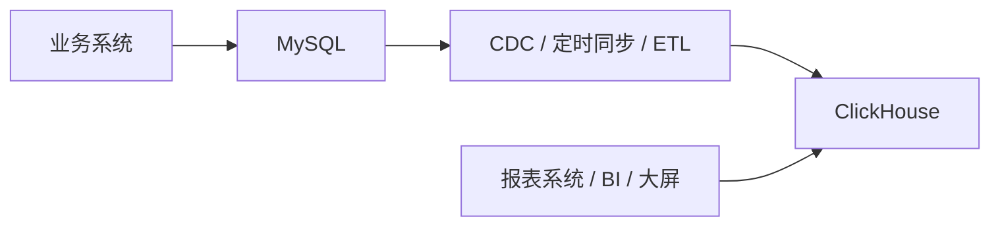

# ClickHouse 快速上手与 MySQL 迁移指南 😎😎😎

## 1. 先说结论

如果你现在用的是 MySQL，然后想“换成 ClickHouse”，先记住一句话：

**大多数场景不是“替换 MySQL”，而是“让 ClickHouse 接管分析型查询”。**

也就是说，通常是这样分工：

- **MySQL**：负责订单、用户、库存、支付这些**事务型业务**
- **ClickHouse**：负责报表、BI、大屏、日志分析、IoT 时序聚合、用户行为分析

如果你直接把 MySQL 的业务库原封不动搬到 ClickHouse，大概率会踩坑，因为 ClickHouse 天生不是为高频事务更新设计的。

所以更准确的说法不是：

- “把 MySQL 改成 ClickHouse”

而是：

- **把原来跑在 MySQL 上的分析型 SQL，迁移到 ClickHouse**

------

## 2. ClickHouse 到底是什么

ClickHouse 是一个**列式存储 OLAP 数据库**。

它最强的点不是“单条插入”和“事务更新”，而是：

- 海量数据聚合
- 高并发报表查询
- 秒级甚至毫秒级统计分析
- 日志 / 埋点 / 监控 / IoT 数据分析

你可以把它理解成：

- MySQL 更像“业务数据库”
- ClickHouse 更像“分析数据库”

比如下面这种 SQL，ClickHouse 通常很擅长：

```sql
SELECT
    toDate(create_time) AS dt,
    device_id,
    count() AS cnt,
    avg(temperature) AS avg_temp,
    max(temperature) AS max_temp
FROM device_metric
WHERE create_time >= now() - INTERVAL 7 DAY
GROUP BY dt, device_id
ORDER BY dt, device_id;
```

------

## 3. ClickHouse 和 MySQL 的核心区别

| 维度 | MySQL | ClickHouse |
|---|---|---|
| 定位 | OLTP 事务型数据库 | OLAP 分析型数据库 |
| 存储方式 | 行存储 | 列存储 |
| 擅长 | 单行查询、事务、频繁更新 | 聚合统计、海量扫描、多维分析 |
| 事务 | 强事务支持 | 不适合复杂事务 |
| JOIN | 强 | 支持，但不建议过度依赖复杂 JOIN |
| UPDATE / DELETE | 高频可接受 | 支持 Mutation，但不适合高频改 |
| 索引 | B+Tree 为主 | 稀疏索引 + 分区 + 排序键 |
| 外键 | 常见 | 不依赖外键 |
| 典型场景 | 订单、账户、库存 | 报表、日志、埋点、设备指标 |
| 数据量级 | GB ~ TB | TB ~ PB 更常见 |

一句话：

**MySQL 擅长“查这条数据是谁”，ClickHouse 擅长“统计过去一年这类数据的规律”。**

------

## 4. 什么场景适合从 MySQL 迁到 ClickHouse

### 适合迁移的场景

- 每天都要跑统计报表
- 大量 `GROUP BY`、`COUNT`、`SUM`、`AVG`
- 时间范围查询很多，比如近 7 天、近 30 天、按小时统计
- 埋点、日志、传感器、设备数据量很大
- MySQL 已经开始因为分析 SQL 太重而拖慢业务

### 不适合直接迁移的场景

- 订单支付核心链路
- 账户余额变更
- 秒杀扣库存
- 需要强事务一致性的业务
- 大量单条更新 / 删除

所以最推荐的迁移姿势是：

- **保留 MySQL 作为主业务库**
- **新增 ClickHouse 作为分析库**

------

## 5. 一个最常见的落地架构



常见同步方式：

- **定时全量 / 增量同步**：简单，适合数据量不大
- **Flink CDC / SeaTunnel / DataX**：更适合正式项目
- **Kafka + 消费写入 ClickHouse**：适合实时链路

如果你做的是 IoT 项目，这个结构尤其常见：

- 设备实时状态放 MySQL
- 设备海量指标明细放 ClickHouse

------

## 6. Docker 一键启动 ClickHouse

### 6.1 快速启动

```powershell
docker run -d `
  --name clickhouse `
  -p 8123:8123 `
  -p 9000:9000 `
  -v clickhouse_data:/var/lib/clickhouse `
  -v clickhouse_logs:/var/log/clickhouse-server `
  clickhouse/clickhouse-server:latest
```

### 6.2 端口说明

| 端口 | 说明 |
|---|---|
| `8123` | HTTP 接口 |
| `9000` | Native TCP 接口，客户端常用 |

### 6.3 常用命令

```powershell
# 查看日志
docker logs clickhouse

# 进入客户端
docker exec -it clickhouse clickhouse-client

# 停止 / 启动
docker stop clickhouse
docker start clickhouse
```

------

## 7. ClickHouse 的几个核心概念

### 7.1 列式存储

ClickHouse 按“列”存数据，不是按“行”。

先假设有一张订单二维表，逻辑上无论放在 MySQL 还是 ClickHouse，查询出来都是下面这样：

| id | user_id | status | amount | create_time |
|---:|---:|---|---:|---|
| 1001 | 101 | 已支付 | 99.00 | 2026-07-20 09:10:00 |
| 1002 | 102 | 已取消 | 199.00 | 2026-07-20 09:15:00 |
| 1003 | 101 | 已支付 | 59.00 | 2026-07-20 10:20:00 |
| 1004 | 103 | 已支付 | 299.00 | 2026-07-21 08:30:00 |

#### 行存储：一行数据通常放在一起

MySQL 这类行式数据库可以把磁盘上的数据简单理解为按行连续组织：

| 物理读取顺序 | 读到的数据 |
|---|---|
| 第 1 行 | `1001, 101, 已支付, 99.00, 2026-07-20 09:10:00` |
| 第 2 行 | `1002, 102, 已取消, 199.00, 2026-07-20 09:15:00` |
| 第 3 行 | `1003, 101, 已支付, 59.00, 2026-07-20 10:20:00` |
| 第 4 行 | `1004, 103, 已支付, 299.00, 2026-07-21 08:30:00` |

因此，下面这种“按订单号查一笔完整订单”的业务查询很合适：

```sql
SELECT *
FROM order_info
WHERE id = 1003;
```

定位到这一行后，同一行里的 `user_id`、`status`、`amount`、`create_time` 都可以一起取到。

#### 列存储：同一列的数据放在一起

ClickHouse 这类列式数据库可以把同一张二维表简单理解为拆成多个列文件：

| 列文件 | 连续保存的数据 |
|---|---|
| `id` | `1001, 1002, 1003, 1004` |
| `user_id` | `101, 102, 101, 103` |
| `status` | `已支付, 已取消, 已支付, 已支付` |
| `amount` | `99.00, 199.00, 59.00, 299.00` |
| `create_time` | `2026-07-20 09:10:00, 2026-07-20 09:15:00, ...` |

例如统计支付订单金额时：

```sql
SELECT sum(amount)
FROM order_info_ck
WHERE status = '已支付';
```

ClickHouse 主要读取 `status` 列判断条件、读取 `amount` 列完成求和；`id`、`user_id`、`create_time` 这三列通常不需要读。数据量达到亿级后，少读几列就意味着更少的磁盘 I/O 和更少的解压工作。

同一列的数据类型相同、取值往往也更相似，例如 `status` 里会大量重复“已支付”，所以也更容易被高效压缩。这就是列式存储在报表和聚合分析中通常更快、压缩率更高的原因。

这意味着：

- 只查少量列时，I/O 更省
- 做聚合统计时更快
- 压缩比通常更高

### 7.2 Engine（表引擎）

ClickHouse 建表必须指定引擎，最常见的是：

- `MergeTree`
- `ReplacingMergeTree`
- `SummingMergeTree`
- `AggregatingMergeTree`

大多数入门场景先记住：

- **明细表优先从 `MergeTree` 开始**

### 7.3 ORDER BY

这里的 `ORDER BY` 不是普通查询里的排序，而是：

- **定义数据在磁盘上的排序键**

它会直接影响：

- 查询性能
- 数据跳过能力
- 压缩效果

所以在 ClickHouse 里，建表时的 `ORDER BY` 很重要。

### 7.4 PARTITION BY

分区常用于按时间拆分数据，比如：

```sql
PARTITION BY toYYYYMM(create_time)
```

这样做的好处：

- 按月管理数据
- 便于清理历史数据
- 查询时间范围时性能更好

------

## 8. MySQL 表结构迁到 ClickHouse 时，思路要变

MySQL 常见建表：

```sql
CREATE TABLE order_info (
    id BIGINT PRIMARY KEY AUTO_INCREMENT,
    user_id BIGINT NOT NULL,
    order_no VARCHAR(64) NOT NULL,
    amount DECIMAL(10,2) NOT NULL,
    status TINYINT NOT NULL,
    create_time DATETIME NOT NULL,
    update_time DATETIME NOT NULL
);
```

如果你直接按这个思路搬到 ClickHouse，不一定是最优的。

ClickHouse 更推荐你想清楚：

- 查询主要按什么维度筛选
- 统计主要按什么维度聚合
- 是否以时间为核心分析轴

例如改成：

```sql
CREATE TABLE order_info_ck
(
    id UInt64,
    user_id UInt64,
    order_no String,
    amount Decimal(10, 2),
    status UInt8,
    create_time DateTime,
    update_time DateTime
)
ENGINE = MergeTree
PARTITION BY toYYYYMM(create_time)
ORDER BY (create_time, user_id, status);
```

注意几点：

- 没有 `AUTO_INCREMENT` 这种 OLTP 味道很重的设计依赖
- 更关注 `PARTITION BY` 和 `ORDER BY`
- 主键不是用来做事务唯一约束的

------

## 9. 常见数据类型映射

| MySQL | ClickHouse | 说明 |
|---|---|---|
| `TINYINT` | `Int8` / `UInt8` | 视是否允许负数 |
| `INT` | `Int32` / `UInt32` | |
| `BIGINT` | `Int64` / `UInt64` | |
| `FLOAT` | `Float32` | |
| `DOUBLE` | `Float64` | |
| `DECIMAL(10,2)` | `Decimal(10,2)` | 金额推荐继续用 Decimal |
| `VARCHAR` | `String` | ClickHouse 没有长度限制这一套 |
| `TEXT` | `String` | |
| `DATETIME` | `DateTime` | |
| `DATE` | `Date` | |
| `BOOLEAN` | `UInt8` / `Bool` | 实际项目里常用 `0/1` |
| `JSON` | `String` / `JSON` | 入门阶段常先存 `String` |
| `NULL` 列 | `Nullable(T)` | 能不用尽量不用 |

经验上：

- 金额用 `Decimal`
- 时间列尽量保留
- 高基数字段不要乱放到排序键最前面

------

## 10. SQL 写法上的变化

### 10.1 MySQL 里的分页查询

```sql
SELECT * FROM order_info
ORDER BY id DESC
LIMIT 20, 10;
```

ClickHouse 也支持 `LIMIT`，但它更常用于分析查询，不建议拿它做高频“后台列表页翻页数据库”。

### 10.2 统计 SQL 在 ClickHouse 更有优势

```sql
SELECT
    toDate(create_time) AS dt,
    status,
    count() AS order_count,
    sum(amount) AS total_amount
FROM order_info_ck
WHERE create_time >= now() - INTERVAL 30 DAY
GROUP BY dt, status
ORDER BY dt, status;
```

### 10.3 时间函数写法不一样

```sql
SELECT toDate(create_time) FROM order_info_ck;
SELECT toYYYYMM(create_time) FROM order_info_ck;
SELECT dateDiff('day', create_time, now()) FROM order_info_ck;
```

### 10.4 计数通常写 `count()`

```sql
SELECT count() FROM order_info_ck;
```

### 10.5 条件聚合很常见

```sql
SELECT
    countIf(status = 1) AS paid_count,
    sumIf(amount, status = 1) AS paid_amount
FROM order_info_ck;
```

这个写法在 ClickHouse 很常用，统计体验比 MySQL 更直接。

------

## 11. 迁移时最容易踩的坑

### 11.1 误以为 ClickHouse 可以直接替代 MySQL 全部业务

这是最大误区。

ClickHouse 不适合下面这类高频操作：

- 单条事务更新
- 多表事务
- 外键一致性校验
- 高频 `UPDATE status = ? WHERE id = ?`

### 11.2 沿用 MySQL 的范式设计

MySQL 喜欢三范式、强关联、多表 JOIN。

ClickHouse 更偏向：

- 适度冗余
- 宽表
- 预聚合

因为分析型数据库的第一目标是：

- **让查询快**

### 11.3 排序键设计不合理

如果你最常按时间查，但建表：

```sql
ORDER BY id
```

那通常就不如：

```sql
ORDER BY (create_time, user_id)
```

### 11.4 想在 ClickHouse 里频繁 UPDATE

虽然能写：

```sql
ALTER TABLE order_info_ck
UPDATE status = 2
WHERE id = 1001;
```

但这不是它的强项。

如果你的业务大量依赖更新，通常要考虑：

- 保留 MySQL 做真实业务表
- ClickHouse 只做同步后的分析表

### 11.5 把去重 / 最新状态问题想简单了

如果你要保存“同一个业务主键的最新状态”，可以研究：

- `ReplacingMergeTree`

但它也不是传统数据库那种“立刻覆盖更新”的语义，要理解它的合并机制。

### 11.6 MySQL 里的 `SELECT ... FOR UPDATE` 迁不过来

这是 Java 后端同学特别容易忽略的一点。

MySQL 里你可能经常这样写：

```sql
SELECT *
FROM account
WHERE id = 1
FOR UPDATE;
```

它的作用是：

- 在事务里锁住这行数据
- 防止并发事务同时修改
- 常用于扣库存、改余额、抢单、状态流转

也就是说，`SELECT ... FOR UPDATE` 这套玩法依赖的是：

- 行锁
- 事务
- 当前读
- 强一致更新语义

但 ClickHouse 不是按这个思路设计的，它**不适合做这种行级加锁事务控制**。

所以如果你原来的 MySQL 代码里大量有下面这些逻辑：

- `select ... for update`
- 先查再改
- 基于事务做并发扣减
- 基于数据库锁防止重复提交

那这部分**不要迁到 ClickHouse**。

正确做法通常是：

- 这类核心并发写逻辑继续放 MySQL
- ClickHouse 只同步结果数据做分析

比如：

- MySQL 负责“库存扣减是否成功”
- ClickHouse 负责“今天每个商品卖了多少”

一句话：

**凡是依赖 `SELECT ... FOR UPDATE` 的地方，基本都说明它更适合留在 MySQL，而不是迁到 ClickHouse。**

------

## 12. 推荐的迁移路线

如果你现在已经有 MySQL 项目，最稳妥的迁移方式如下。

### 12.1 第一步：先挑“分析型表”

优先挑这些表迁：

- 订单明细统计
- 用户行为日志
- 设备上报记录
- 操作审计日志
- 报表明细表

不要一上来就迁：

- 用户账户表
- 支付流水核心表
- 库存扣减表

### 12.2 第二步：明确查询场景

先列出你最常跑的 SQL，比如：

- 按天统计订单量
- 按设备统计近 7 天平均值
- 按地区统计活跃用户
- 按小时统计告警次数

然后根据这些 SQL 来设计：

- 分区字段
- 排序键
- 是否需要宽表

### 12.3 第三步：在 ClickHouse 建分析表

例如设备指标表：

```sql
CREATE TABLE device_metric
(
    device_id String,
    product_id UInt64,
    temperature Float32,
    ph Float32,
    turbidity Float32,
    create_time DateTime
)
ENGINE = MergeTree
PARTITION BY toYYYYMM(create_time)
ORDER BY (device_id, create_time);
```

### 12.4 第四步：把 MySQL 数据导入 ClickHouse

### 方式一：先做一次性初始化导入

```sql
INSERT INTO order_info_ck
SELECT
    id,
    user_id,
    order_no,
    amount,
    status,
    create_time,
    update_time
FROM mysql(
    '127.0.0.1:3306',
    'test_db',
    'order_info',
    'root',
    '123456'
);
```

### 方式二：后续做增量同步

常见选择：

- 定时任务按 `update_time` 拉增量
- Canal / Debezium / Flink CDC
- SeaTunnel / DataX
- Kafka 实时同步

### 12.5 第五步：先切报表，不切核心交易

你应该先做：

- 把原来压 MySQL 的统计 SQL 改查 ClickHouse

而不是先做：

- 让核心下单逻辑直接写 ClickHouse

这是两种完全不同的风险级别。

------

## 13. 一组很实用的迁移对照

### 原来在 MySQL 里统计最近 30 天订单趋势

```sql
SELECT
    DATE(create_time) AS dt,
    COUNT(*) AS cnt,
    SUM(amount) AS total_amount
FROM order_info
WHERE create_time >= NOW() - INTERVAL 30 DAY
GROUP BY DATE(create_time)
ORDER BY dt;
```

### 迁到 ClickHouse

```sql
SELECT
    toDate(create_time) AS dt,
    count() AS cnt,
    sum(amount) AS total_amount
FROM order_info_ck
WHERE create_time >= now() - INTERVAL 30 DAY
GROUP BY dt
ORDER BY dt;
```

### 原来在 MySQL 里统计支付成功订单数

```sql
SELECT COUNT(*)
FROM order_info
WHERE status = 1;
```

### 迁到 ClickHouse

```sql
SELECT countIf(status = 1)
FROM order_info_ck;
```

------

## 14. SpringBoot 怎么接 ClickHouse

如果你是 Java 后端项目，接入方式和 MySQL 类似，但使用习惯会不一样。

### 14.1 Maven 依赖

```xml
<dependency>
    <groupId>com.clickhouse</groupId>
    <artifactId>clickhouse-jdbc</artifactId>
    <version>${clickhouse.version}</version>
</dependency>
```

> 版本号按你的项目实际选择，不要机械照抄旧博客。

### 14.2 `application.yml`

```yaml
spring:
  datasource:
    clickhouse:
      driver-class-name: com.clickhouse.jdbc.ClickHouseDriver
      url: jdbc:clickhouse://127.0.0.1:8123/test_db
      username: default
      password:
```

### 14.3 一个简单查询示例

```java
@Repository
public class OrderAnalysisRepository {

    private final JdbcTemplate jdbcTemplate;

    public OrderAnalysisRepository(JdbcTemplate jdbcTemplate) {
        this.jdbcTemplate = jdbcTemplate;
    }

    public List<Map<String, Object>> queryDailyOrderTrend() {
        String sql = """
                SELECT
                    toDate(create_time) AS dt,
                    count() AS cnt,
                    sum(amount) AS total_amount
                FROM order_info_ck
                WHERE create_time >= now() - INTERVAL 30 DAY
                GROUP BY dt
                ORDER BY dt
                """;
        return jdbcTemplate.queryForList(sql);
    }
}
```

### 14.4 代码层面的变化

如果你原来大量依赖：

- MyBatis-Plus 的通用 CRUD
- 实体类直接映射业务表
- 高频更新状态字段

那切到 ClickHouse 后要改思路：

- 分析查询优先写手工 SQL
- 少依赖“通用 CRUD”幻想
- 不要把 ClickHouse 当作业务主库

------

## 15. 如果你现在项目里想“从 MySQL 改到 ClickHouse”，我建议你这样做

这是最实用的一套落地顺序：

1. 先挑一个最慢的统计接口
2. 找出它依赖的 MySQL 明细表
3. 在 ClickHouse 建一张对应分析表
4. 先把历史数据导进去
5. 再把新增数据通过定时任务或 CDC 同步进去
6. 把这个统计接口的查询源切到 ClickHouse
7. 观察查询耗时、数据库压力、结果一致性
8. 稳定后再迁第二个、第三个报表

这个路线的好处是：

- 风险小
- 见效快
- 不会把核心业务链路搞挂

------

## 16. 一个很重要的认知：不是“改数据库”，而是“改数仓思维”

你从 MySQL 迁到 ClickHouse，本质上不只是改 JDBC URL。

你真正要改的是：

- 从“面向事务建模”
- 变成“面向分析建模”

也就是从关注：

- 主键
- 外键
- 行级更新
- 事务一致性

变成关注：

- 分区
- 排序键
- 宽表
- 聚合查询
- 数据同步链路

这才是迁移的核心。

------

## 17. 一句话总结

**ClickHouse 不是 MySQL 的平替，它更像 MySQL 的分析加速器。**

如果你的项目里：

- 业务写入在 MySQL
- 统计分析在 ClickHouse

那大概率就是一套比较合理的架构。

------

## 18. 相关笔记

- [[ClickHouse-Quickstart]] —— Docker 部署、建表、插入与聚合查询练习
- [[技术栈/数据库/MySQL/SQL知识]] —— SQL 基础
- [[技术栈/数据库/MySQL/MySQL索引/索引和索引下推]] —— 理解索引与查询优化
- [[技术栈/数据库/PostgreSQL/PostgreSQL知识库]] —— 另一种常见数据库对比参考
- [[项目与成长/项目选题/IoT-service]] —— 如果你做 IoT，这类场景很适合结合 ClickHouse

