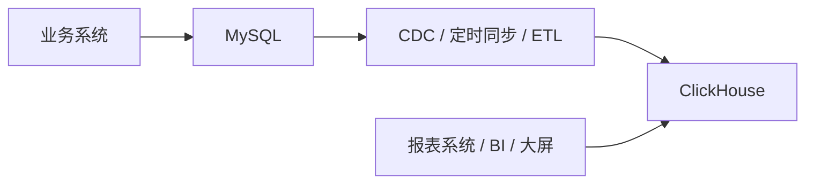

# 5. 一个最常见的落地架构

常见同步方式：

- **定时全量 / 增量同步**：简单，适合数据量不大
- **Flink CDC / SeaTunnel / DataX**：更适合正式项目
- **Kafka + 消费写入 ClickHouse**：适合实时链路

如果你做的是 IoT 项目，这个结构尤其常见：

- 设备实时状态放 MySQL
- 设备海量指标明细放 ClickHouse

------

