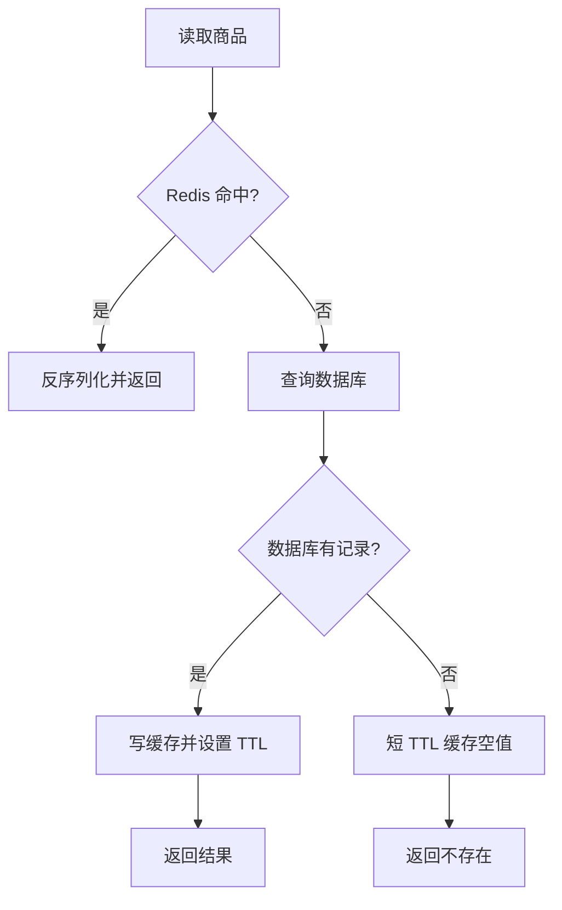
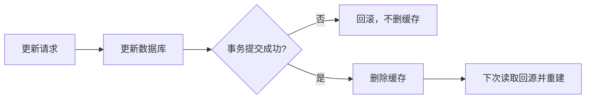

# 关于使用缓存：从 Cache Aside 到热点 Key 😢🎉

> 缓存的价值是用更便宜、更快的存储承接重复读取；代价是引入数据副本、一致性窗口、失效策略和额外故障模式。不是所有慢查询都应该先加缓存。

------

## 一、先判断是否值得缓存

适合缓存的数据通常满足：

- 读多写少，同一数据会被重复读取；
- 允许短暂不一致；
- 查询或计算成本较高；
- 值大小可控，Key 数量和 TTL 能估算；
- 未命中时有明确回源和降级策略。

不适合直接缓存：

- 余额、强一致库存等“写后必须立即读到最新值”的核心判断；
- 写入频率接近或高于读取频率的数据；
- 每个请求都是不同条件、几乎不会命中的一次性查询；
- 无法限制大小的超大对象；
- 数据源本身已经足够快，而缓存维护成本更高。

优化顺序通常是：先定位慢点，检查 SQL/索引和调用链，再考虑批量查询、读模型、缓存或架构调整。

## 二、最常用模式：Cache Aside

Cache Aside（旁路缓存）由业务代码同时维护数据库与缓存。

### 2.1 读流程



### 2.2 写流程



一般优先选择“**更新数据库，提交后删除缓存**”，而不是同时更新两个副本。删除能让下一次读以数据库为准，逻辑更简单；但删除失败与并发回填仍会形成短暂不一致，所以还需要 TTL 和可靠补偿。详见 [[项目与成长/面经/如何解决缓存和数据库的数据不一致性]]。

## 三、普通缓存查询示例

```java
@Service
public class ProductQueryService {
    private static final String KEY_PREFIX = "product:detail:";
    private static final String NULL_VALUE = "__NULL__";

    private final StringRedisTemplate redisTemplate;
    private final ProductRepository productRepository;
    private final ObjectMapper objectMapper;

    public Optional<Product> findById(Long productId) {
        String key = KEY_PREFIX + productId;
        String cached = redisTemplate.opsForValue().get(key);

        if (cached != null) {
            if (NULL_VALUE.equals(cached)) {
                return Optional.empty();
            }
            return Optional.of(readProduct(cached));
        }

        Product product = productRepository.findById(productId);
        if (product == null) {
            redisTemplate.opsForValue().set(
                    key, NULL_VALUE, Duration.ofMinutes(2));
            return Optional.empty();
        }

        long jitterSeconds = ThreadLocalRandom.current().nextLong(300);
        redisTemplate.opsForValue().set(
                key,
                writeProduct(product),
                Duration.ofMinutes(30).plusSeconds(jitterSeconds));
        return Optional.of(product);
    }

    // readProduct / writeProduct 统一处理 JSON 和异常，代码省略
}
```

这个示例包含三条重要边界：

- 用短 TTL 空值缓存防止不存在 ID 持续打数据库；
- 正常数据一定设置 TTL，避免永久脏数据和内存只增不减；
- TTL 加随机抖动，避免一批 Key 在同一时刻集中失效。

空值标记必须与真实业务值区分，也要限制空值 Key 的数量，不能让攻击者用随机 ID 填满 Redis。

## 四、数据库提交后再删缓存

```java
@Transactional
public void updateProduct(Product product) {
    productRepository.update(product);

    TransactionSynchronizationManager.registerSynchronization(
            new TransactionSynchronization() {
                @Override
                public void afterCommit() {
                    redisTemplate.delete(KEY_PREFIX + product.id());
                }
            });
}
```

为什么不在事务提交前删除？如果先删缓存，随后数据库事务回滚，其他请求可能回源并缓存数据库旧值，引入无意义的失效和竞态。

上面的 `afterCommit` 仍不是完整可靠方案：数据库已经提交后，Redis 删除失败不能再回滚数据库。生产系统通常增加以下一种补偿：

- 本地 Outbox 与后台重试；
- 可靠 MQ 缓存失效事件；
- 订阅 Binlog/CDC 后统一删除；
- 定时校验与 TTL 兜底。

删除操作天然幂等，重复删除通常没有问题；补偿消费者仍需记录失败、重试和死信。

## 五、缓存穿透、击穿、雪崩不要混淆

| 问题 | 现象 | 核心原因 | 常用方案 |
| --- | --- | --- | --- |
| 穿透 | 缓存和数据库都没有，重复回源 | 恶意/错误查询不存在 Key | 参数校验、空值缓存、Bloom Filter、限流 |
| 击穿 | 某个热点 Key 失效，大量请求同时回源 | 单 Key 高并发重建 | 互斥重建、逻辑过期、预热、限流 |
| 雪崩 | 大量 Key 同时失效或 Redis 故障 | 集中过期、缓存层不可用 | TTL 抖动、多级缓存、限流降级、高可用 |

### 5.1 防穿透

优先级通常是：

1. 校验 ID 格式、租户和权限；
2. 对数据库不存在的数据缓存短 TTL 空值；
3. Key 空间巨大且可提前构建集合时再考虑 Bloom Filter；
4. 对异常来源限流和封禁。

Bloom Filter 可能误判“存在”，不能替代数据库；数据新增时还要同步更新过滤器。

### 5.2 防击穿：互斥重建

```text
缓存 miss
  -> 尝试获得 product:123 的重建锁
     -> 获得锁：再次检查缓存，仍 miss 才查 DB 并回填
     -> 未获得锁：短暂等待、返回旧值、降级或快速失败
```

加锁后必须**二次检查缓存**，否则等待锁的线程会依次重复查询数据库。

使用 Redisson 等成熟实现时仍要考虑：

- 锁等待和租期；
- 持锁线程异常；
- 解锁前判断当前线程是否持有；
- 数据库查询超时；
- 热点期间大量等待线程占用 Web 容器。

锁只包围“回源与回填”，不能让每次缓存命中也抢锁。

### 5.3 防击穿：逻辑过期

缓存值携带逻辑过期时间，过期后仍先返回旧值，再由一个线程异步重建：

```json
{
  "expireAt": "2026-08-13T10:30:00+08:00",
  "data": {
    "id": 123,
    "name": "水质传感器"
  }
}
```

优点是热点请求延迟稳定，不会瞬间全部回源；代价是明确允许一段时间读取旧数据，还要处理后台重建失败和长期陈旧告警。

### 5.4 防雪崩

- TTL 加随机抖动；
- 发布或大促前分批预热，不要同秒设置相同 TTL；
- Redis 故障时限制数据库回源并返回降级结果；
- 为本地缓存设置容量和较短 TTL，作为有限兜底；
- 演练缓存集群不可用，确认数据库不会被瞬间打满。

## 六、热点 Key 怎么处理

热点 Key 不是“值很大”，而是访问频率或写入频率异常集中。先通过 Redis hotkeys、命令统计、应用指标和流量日志确认热点来源。

### 6.1 热读 Key

- 本地 Caffeine + Redis 两级缓存；
- 逻辑过期与后台刷新；
- 预热并错峰续期；
- 将不可变内容下沉 CDN；
- 限制单调用方和单 Key QPS。

两级缓存的数据链：

```text
请求 -> 本地缓存 -> Redis -> 数据库
```

删除 Redis 并不会自动让所有 JVM 的本地缓存立即失效。必须选择广播失效、短 TTL、版本化 Key 或订阅变更事件，并接受相应一致性窗口。

### 6.2 热写 Key

- 检查是否能按业务维度拆 Key；
- 合并/批量写，减少命令次数；
- 避免对同一个大 Hash 持续修改；
- 对计数类需求评估分片计数后汇总；
- 不能拆分时做限流和容量评估。

拆 Key 会增加聚合与一致性复杂度。不要为了“均匀”随意加随机后缀，让业务再也找不到完整结果。

## 七、Key 与 Value 设计

推荐格式：

```text
业务:对象:版本:标识
product:detail:v2:123
campus:device-status:v1:device-001
```

设计原则：

- Key 可读且长度可控，不把完整请求 JSON 当 Key；
- 带业务前缀，避免不同模块冲突；
- 不兼容结构升级时使用版本；
- Value 只保留读路径需要的字段；
- 大对象考虑拆分或改用专门存储，避免一次网络传输过大；
- TTL 按业务新鲜度定义，而不是统一“30 分钟”。

不要依赖模糊 `KEYS product:*` 做线上批量删除。维护反向索引、版本号或事件驱动失效，必要时使用渐进式 `SCAN`，并评估集群模式行为。

## 八、Spring Cache 适合什么场景

```java
@Cacheable(cacheNames = "product", key = "#productId")
public Product findById(Long productId) {
    return productRepository.findById(productId);
}

@CacheEvict(cacheNames = "product", key = "#product.id")
public void update(Product product) {
    productRepository.update(product);
}
```

Spring Cache 适合简单方法级缓存，但要注意：

- 代理自调用可能绕过缓存注解；
- 缓存空值、TTL、序列化通常需要额外配置；
- 注解执行时机与数据库事务提交时机要核对；
- 热点互斥重建、可靠失效和多级缓存不是一个注解自动解决的；
- Key 的 SpEL 要稳定，不能包含易变或超大对象。

表达式用法见 [[项目与成长/实习方法论/SpringBoot/SPEL表达式]]。

## 九、降级与容灾

Redis 超时后不能让每个请求都直接查询数据库，否则缓存故障会转化为数据库故障。读路径应提前定义：

| 数据类型 | Redis 不可用时 |
| --- | --- |
| 非关键展示信息 | 返回本地旧值或默认值 |
| 可限流查询 | 限制回源并快速失败 |
| 强一致核心判断 | 绕过缓存，查询权威数据源并严格限流 |
| 大流量热点 | 降级静态页/快照，保护数据库 |

缓存客户端要有连接和命令超时，重试必须有上限；故障时无限重试只会放大拥塞。

## 十、必须监控的指标

- 命中率：按缓存名、接口和 Key 类型拆分；
- Redis 命令 P50/P95/P99 与超时率；
- DB 回源 QPS、耗时和失败率；
- 缓存重建次数、耗时、失败数与并发等待数；
- 空值缓存比例；
- 热点 Key QPS 与 Value 大小；
- Redis 内存、淘汰数、过期数、连接数和网络带宽；
- 删除缓存失败和补偿积压。

总命中率高不代表健康：一个冷门接口 99% 命中，也可能掩盖核心热点 Key 正在持续击穿。

## 十一、常见错误

1. 缓存永不过期，也没有主动失效。
2. 先删缓存，再提交数据库事务。
3. 读 miss 后所有线程同时查数据库。
4. 给所有 Key 设置完全相同的 TTL。
5. Redis 异常时无限制回源。
6. 把分布式锁当成缓存一致性的全部答案。
7. 删除失败只打日志，没有重试、告警和补偿。
8. 两级缓存只删除 Redis，忘记其他 JVM 的本地副本。
9. 使用 Java 原生序列化，升级后兼容困难且内容不可读。
10. 在日志中输出完整缓存值，泄露隐私并放大日志量。

## 十二、方案选择速查

| 场景 | 推荐起点 |
| --- | --- |
| 普通读多写少 | Cache Aside + TTL + 提交后删缓存 |
| 查询不存在 ID 很多 | 参数校验 + 短 TTL 空值缓存 |
| 单个热点 Key | 逻辑过期或互斥重建 + 限流 |
| 大量 Key 集中过期 | TTL 抖动 + 分批预热 |
| 本地延迟要求极低 | Caffeine + Redis，并设计失效广播 |
| 删除必须可靠 | Outbox/MQ/CDC + 幂等删除 + 告警 |
| 强一致核心数据 | 权威数据源读取，缓存只做非关键加速或不使用 |

------

## 🔗 相关笔记

- [[项目与成长/实习方法论/数据库/Redis/数据结构]] —— Redis 数据结构与命令
- [[使用Redis构建分布式锁]] —— 分布式锁基础
- [[项目与成长/实习方法论/数据库/Redis/Redisson/redisson_lock_guide]] —— Redisson 锁的生产实践
- [[项目与成长/面经/如何解决缓存和数据库的数据不一致性]] —— 并发一致性与补偿方案
- [[项目与成长/面经/redis内存满了会发生什么]] —— 内存淘汰与容量风险
